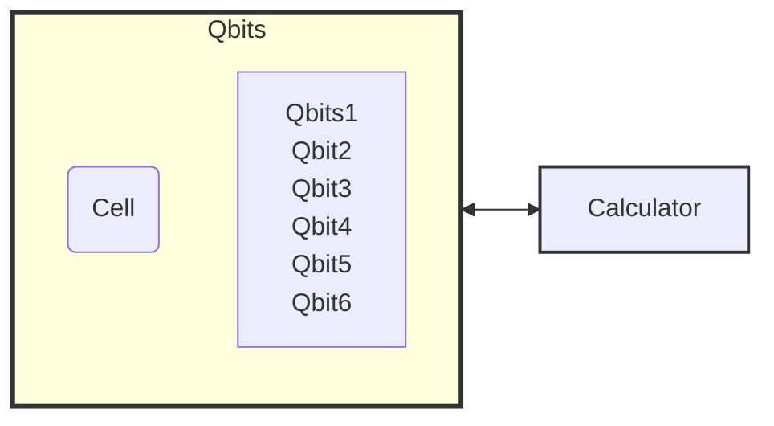
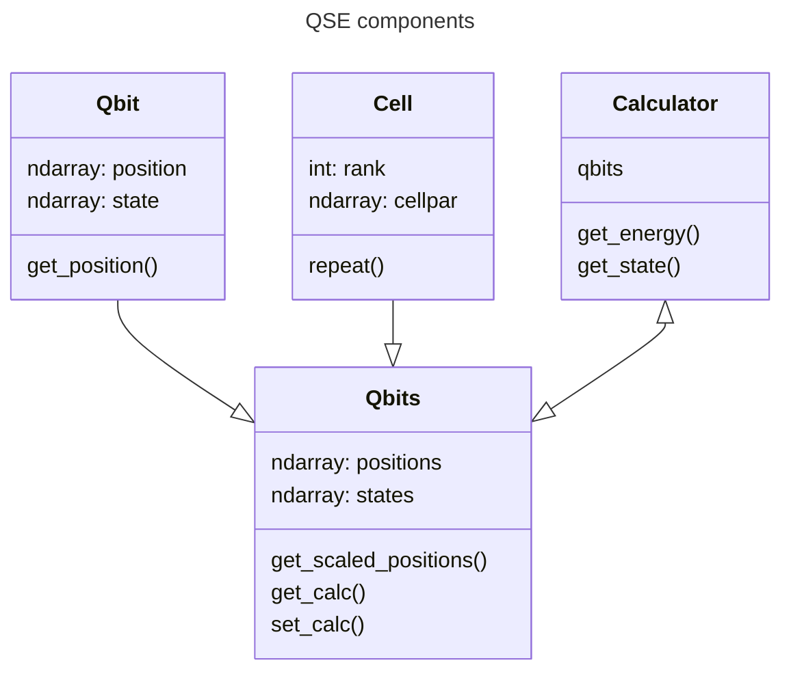

# qse
Quantum Simulation Environment.

# QSE
The Quantum Simulation Environment (QSE) is package adapted from Atomic Simulation Environment (ASE) to suit the needs for an abstract representation for defining a i. quantum computing system, and ii. computing operations/simulations in a vendor agnostic way. ASE's modular nature, and extensability make it very useful for a similar quantum computing application.

Following are the primary classes for the QSE -

|Class  | Description                            |
|-------|-----------------------------------     |
| Qbit  | Class to represent sinple qubit        |
| Qbits | Class for a collection of qibits       |
| Cell  | Class to construct periodic structures |

In the current stage the Qbits object can be constructed from coordinates, and periodic structures can be constructed by manipulating cell objects.

QSE layout is divided into two major objects, ==Qbits== and ==Calculators==.

---

Points to note

- Check interoperability of Sequence and waveform.
    - Waveform is any timeseries data. 
    - Sequence is a pair of waveforms one for $\Omega$ and one for $\delta$.
    - The output on the same time grid can be expressed as a waveform.
- Checkout channel
