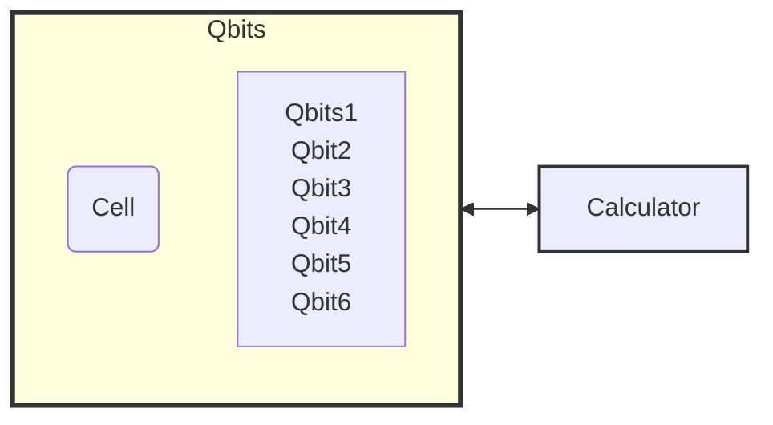
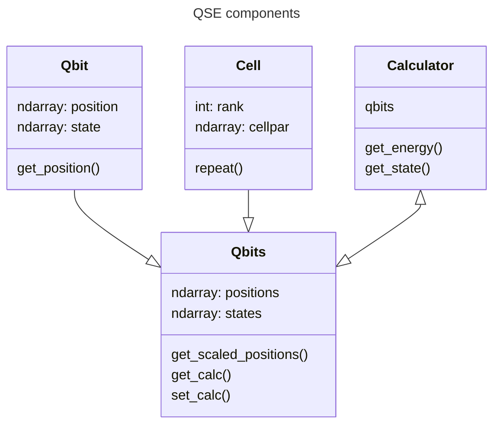
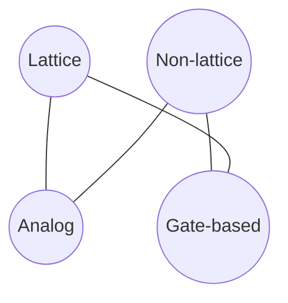

# QSE
The Quantum Simulation Environment (QSE) package is adapted from Atomic Simulation Environment (ASE) to suit the needs for an abstract representation for
- `i. defining quantum computing systems`
- `ii. computing operations/simulations`

in a vendor agnostic way. ASE's modular nature, and extensability make it very useful for a similar quantum computing application.


## Installation (new)
It is recommmended to install within a new Conda environment.
To create a new conda environment use
```bash
conda create -n <my-env>
```
then activate this environment with
```bash
conda activate <my-env>
```
Install pip using
```bash
conda install pip
```

Make sure you're in the directory where the `pyproject.toml` file is situated and install the package and its dependencies using `pip`
```bash
pip install .
```
If you want to be able to edit the code and have the changes immediately take place without requiring a new installation, use the editable flag
```bash
pip install -e .
```
You can verify the package and dependencies were installed correctly with
```bash
pip list
```
if you installed `qse` in editable mode, it should have a Editable project location.

## Installation (old)
Currently it's a pure python packages, so with the source all one needs is to save the repo somewhere, and add it to the `$PYTHONPATH`.

One can make a python wheel for it by simply running the following in the downloaded folder where `pyproject.toml` file is situated, assuming you have build module installed in your python environment (it can be installed through `pip install build`).

```bash
python3 -m build
```

The above creates the python wheel for the package, and places in the dist folder. You can install the package using pip in any python environment as following -

```bash
pip install path-to-qse-wheel.whl
```

>[TIP] Most of the dependencies are added in the packaging, so it's recommended to install the wheel in a fresh or empty python environment, whether created using conda, or venv.

## QSE Overview
Following are the primary classes for the QSE -

|Class  | Description                            |
|-------|-----------------------------------     |
| Qbit  | Class to represent sinple qubit        |
| Qbits | Class for a collection of qibits       |
| Cell  | Class to construct periodic structures |
|Calculator| Class to construct a suit of computation|

In the current stage the Qbits object can be constructed from coordinates, and periodic structures can be constructed by manipulating cell objects.

QSE layout is divided into two major objects, **Qbits** and **Calculators**.







---

Points to note

- Check interoperability of Sequence and waveform.
    - Waveform is any timeseries data. 
    - Sequence is a pair of waveforms one for $\Omega$ and one for $\delta$.
    - The output on the same time grid can be expressed as a waveform.
- Checkout channel

